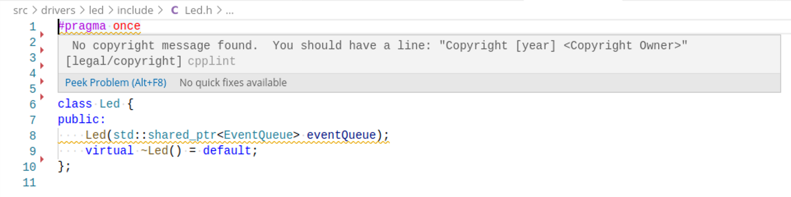

# cpplint-webkit

Small script for checking [WebKit Code Style Guidelines](https://webkit.org/code-style-guidelines/) with [cpplint](https://marketplace.visualstudio.com/items?itemName=mine.cpplint) Visual Studio code plugin.

 

## Install

* Install [check-webkit-style](https://github.com/jeppefrandsen/check-webkit-style): `sudo git clone https://github.com/jeppefrandsen/check-webkit-style /usr/share/check-webkit-style` (The script is checking for a SCM so keep files as a git checkout)
* Copy the `cpplint-webkit` script to `/usr/bin`
* Install the [cpplint](https://marketplace.visualstudio.com/items?itemName=mine.cpplint) VS Code plugin
* Add `"cpplint.cpplintPath": "/usr/bin/cpplint-webkit"` to your VS Code `settings.json`
* Configure any options to [check-webkit-style](https://github.com/jeppefrandsen/check-webkit-style) with the `CPPLINT_WEBKIT_ARGS` environment variable

Let me know if you have any issues :beers:
