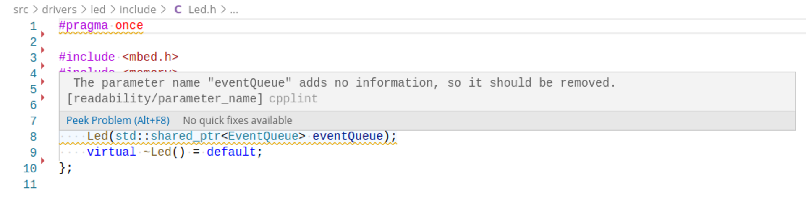

# cpplint-webkit

Small script for checking [WebKit Code Style Guidelines](https://webkit.org/code-style-guidelines/) with [cpplint](https://marketplace.visualstudio.com/items?itemName=mine.cpplint) Visual Studio code plugin.

 

## Install

* Install [check-webkit-style](https://github.com/jeppefrandsen/check-webkit-style): `sudo git clone https://github.com/jeppefrandsen/check-webkit-style /usr/bin/check-webkit-style` (The script is checking for a SCM so keep files as a git checkout)
* Copy the `cpplint-webkit` script to e.g. `/usr/bin`
* Install the [cpplint](https://marketplace.visualstudio.com/items?itemName=mine.cpplint) Visual Studio Code plugin
* Configure the `Cpplint Path` under `File – Preferences – Settings – Extensions - cpplint` to `cpplint-webkit`
* Configure any options to [check-webkit-style](https://github.com/jeppefrandsen/check-webkit-style) with the `CPPLINT_WEBKIT_ARGS` environment variable
* Configure the default files to be checked with the `CPPLINT_WEBKIT_FILES` environment variable. This is only needed if you want to be able to check all files e.g. as part of your CI flow)

Let me know if you have any issues :beers:
