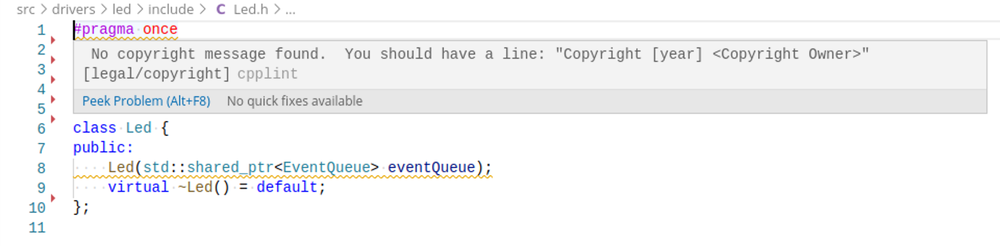

# cpplint-webkit

Small script for checking [WebKit Code Style Guidelines](https://webkit.org/code-style-guidelines/) with [cpplint](https://marketplace.visualstudio.com/items?itemName=mine.cpplint) Visual Studio code plugin. The repository also contains the `check-webkit-style` tool extracted from the [WebKit](https://github.com/WebKit/WebKit/) repository with minor modifications e.g. to include .hpp files in the whitelist.

 

## Install

* Clone this repository or download the source from a release tag
* Extract and change to the cpplint-webkit directory
* Install the tool e.g. in a docker container by running `./install`
* Install the [cpplint](https://marketplace.visualstudio.com/items?itemName=mine.cpplint) VS Code plugin (can also be added to e.g. `devcontainer.json` for automatic installation)
* Configure any options to WebKit's `check-webkit-style` with the `CPPLINT_WEBKIT_ARGS` environment variable
